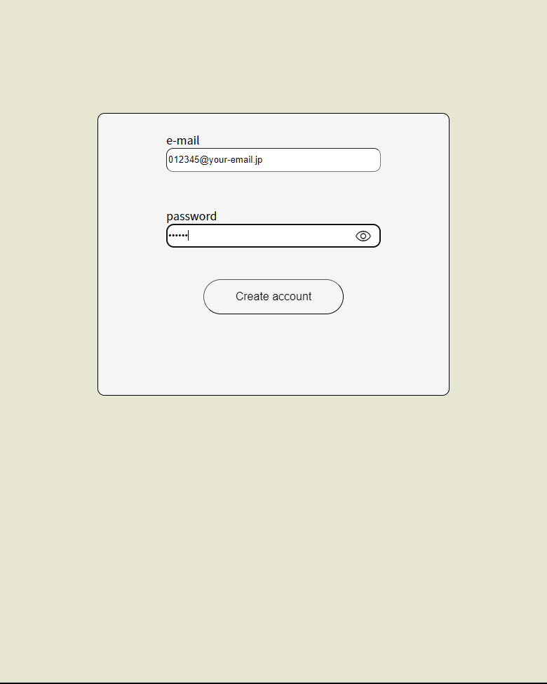
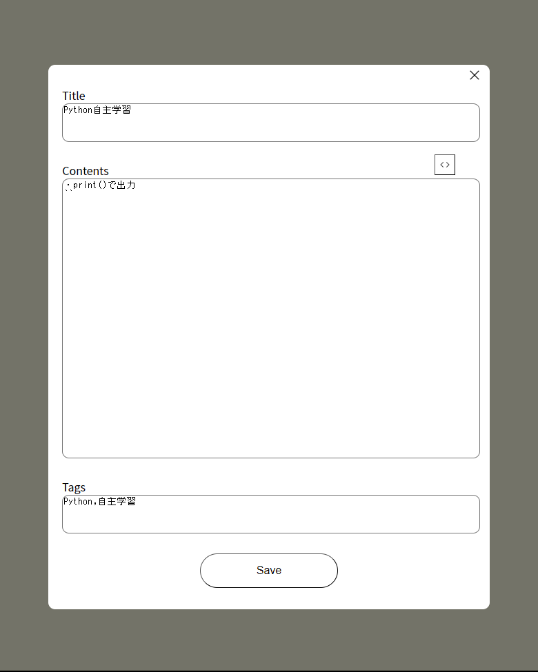
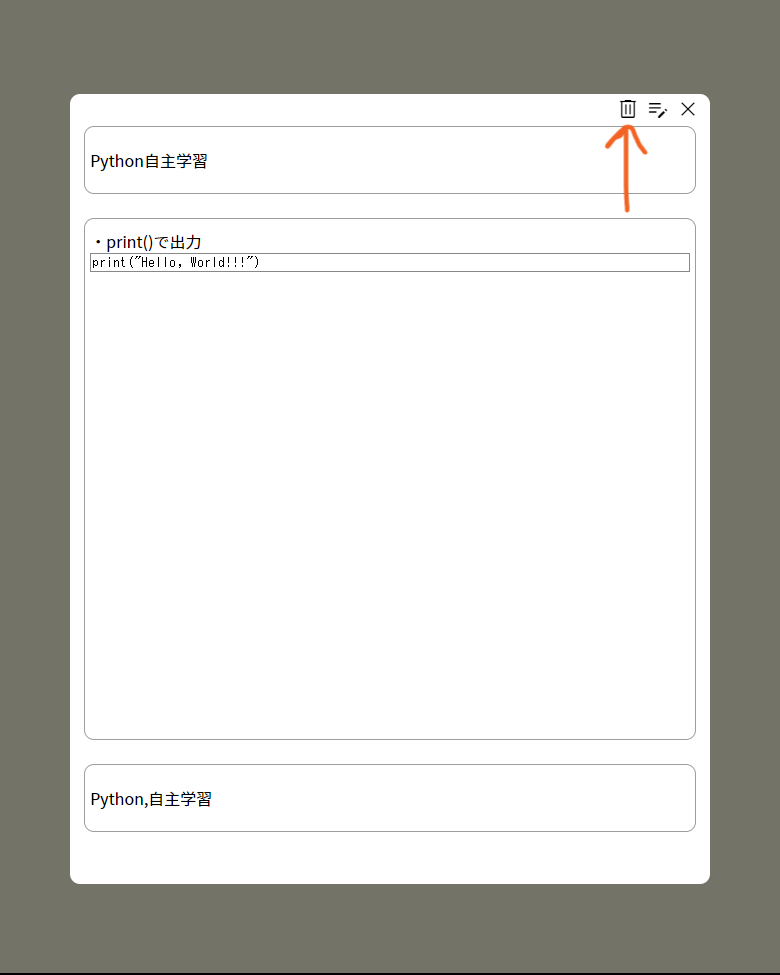

# memo-app
## 1.はじめに  
普段プログラミングをしていて、参考になったサイトや記法をまとめるためのメモアプリを作りました。  
[memo-app](https://haruto17-memo-app.deno.dev/)

## 2.使い方
### 1.アカウント作成&ログイン
メール/パスワードかGitHubアカウントでログインすることができます。  

アカウントがない場合、「Create account」をクリックし、アカウントを作成します。  
メールアドレスとパスワードを入力し、「Create account」をクリックします。  

アカウントが作成されると、メインの画面にリダイレクトします。  

### 2.メモの作成
画面左下の「＋」をクリックします。
メモを作成する際は、以下の制限があります。
- タイトルは **100** 文字以内
- 本文は改行を含め **1000** 文字以内
- タグはカンマ区切りで入力、最大 **5** 個まで

内容を入力したら「Save」をクリックします。

### 3.メモの編集
画面に表示されているメモをクリックして、編集アイコンをクリックします。  

「Edit」をクリックすることで、編集が完了します。

### 4.メモの削除
画面に表示されているメモをクリックして、ゴミ箱アイコンをクリックします。  

### 5.メモの検索
画面左上にある検索フォームにメモのタイトル・タグを入力することでメモを検索できます。  
検索結果をリセットしたい場合は、フォーム横のリセットボタンをクリックします。

### 6.ログアウト
アイコンをクリックすることでログアウトできます。完了するとログイン画面にリダイレクトします。
